# Architecture & BPMN — trustless XNO⇄XMR DEX

This document is the **full technical process model** of the app: every pool
(actor), lane, task, gateway, timer, and message flow, drawn as BPMN-style
diagrams (Mermaid, rendered natively by GitHub) plus a written specification.

It is generated from the **actual code**, not an idealised design. Where the
implementation differs from what you might expect, that is called out inline and
collected in [§9 Known gaps](#9-known-gaps--honest-notes). Read that section
before trusting any single flow.

**Regenerated 2026-08-26** against `a050c5e`. Changes folded in since the previous
revision (`5f4cd08`, 2026-08-25 22:50): the self-test UI was deleted, the taker
flow now actually consumes the selected offer, the earn calculator was reframed
from rank tiers to turnover scenarios, a **server-side Nano PoW proxy** was added
(the first and only backend function — see §1), Nano RPC gained HTTP-200
ban-body failover, the Monero node list was re-verified from a browser, and
wallet unlock now resumes a saved Monero scan.

**Source of truth (files referenced throughout):**

| Area | Files |
|---|---|
| Wallet | `web/wallet.js`, `web/wallet-worker.js`, `web/index.html` (wallet UI) |
| Earn / Smart Offer / beacon | `web/beacon.js`, `web/index.html` (`smart*`, `earn*`), `swap-core/dex-core/src/beacon.rs`, `swap-core/wasm-bridge/src/lib.rs` |
| Swap core (crypto) | `web/funded_swap.js`, `web/two_party.js`, `swap-core/signing/src/{lib,adaptor}.rs`, `swap-core/nano-ceremony/src/ceremony.rs`, `swap-core/monero-side/src/{isolation,cosign}.rs`, `swap-core/wasm-monero/src/lib.rs` |
| Taker / transport / RPC | `web/index.html` (`swOffers*`, `tpRelay`, `RPC_DEFAULTS`), `web/mailbox.js`, `web/ledger_relay.js` |
| Chunked responder (shipped, not wired) | `web/swap_machine.js`, `web/swap_responder.js` |
| Backend (the only one) | `deploy/vercel/api/work.js` |

---

## Legend

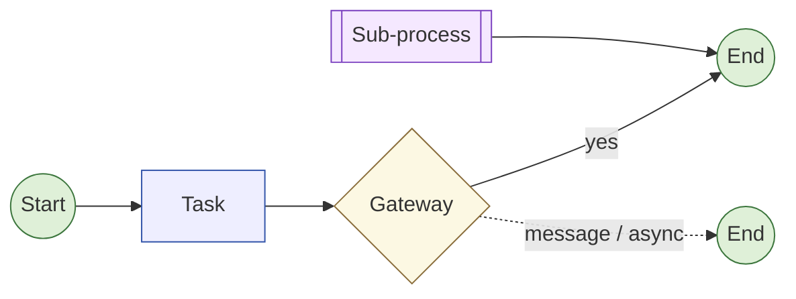

- **Solid arrow** = sequence flow. **Dashed arrow** = message flow / async / on-chain persistence.
- **Lanes** are drawn as `subgraph` boxes; the actor owning a task is the lane it sits in.

---

## 1. System context (pools)

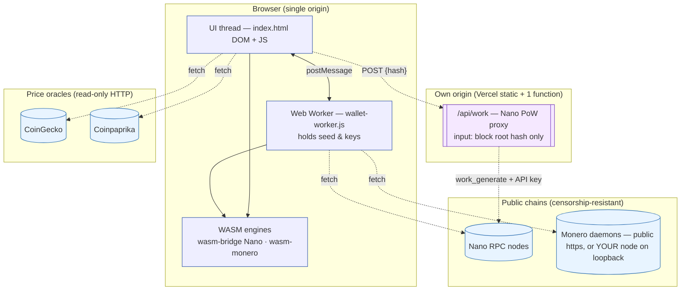

**Custody invariant (unchanged, absolute):** no server of ours ever sees key
material, a seed, a passphrase, a view key, or a balance. Secret key material
lives **only inside the Web Worker**; the DOM cannot read the Worker's closure
scope (§2.5). Every signature is produced in the browser.

**Revised "no server" claim — read this.** The previous revision said *"there is
no server."* That is no longer literally true. One serverless function now
exists: **`/api/work`** (`deploy/vercel/api/work.js`), a Nano proof-of-work
proxy. Its honest scope:

- **Input:** a block **root hash** (64 hex) and optional difficulty. Nothing else;
  the body is capped at 4 KiB and both fields are regex-validated.
- **Output:** `{work, difficulty}`.
- **It never** sees a seed, key, passphrase, address, balance, or amount, and it
  **cannot broadcast** anything. A root hash is public and non-identifying.
- **Why it exists:** it holds the upstream `work_generate` API key server-side
  (browsers cannot hold a secret) and returns GPU work in ~1 s, where in-browser
  PoW takes far longer.
- **It is optional and defeatable.** Settings → *Proof-of-work* has a
  **local-only** toggle (`localStorage["xnoxmr_pow_local"] === "1"`), which skips
  the proxy entirely and grinds PoW in wasm. With it on, the app is once again
  fully serverless. The proxy is the *default* because it is dramatically faster,
  not because anything depends on it.

The only other network calls are to public chain RPC nodes and two read-only
price oracles. **The retired Hostinger relay VPS and the native wallet-helper
(`ws://127.0.0.1:47999`) are both gone** — deleted in `f3c7c67` and the earlier
F4 cleanup. Settlement is now browser-only; there is no local helper path.

---

## 2. Wallet lifecycle

Lanes: **User**, **UI thread**, **Web Worker**, **WASM**, **localStorage /
sessionStorage**. The Worker is the only lane that ever holds `seedHex` at
runtime.

Recurring data objects:
`cipher = {v:1, mem:65536, salt, iv, ct}` at `localStorage["nearinstant_wallet_v1"]`;
`pass` (plaintext passphrase) transiently at `sessionStorage["nearinstant_unlock_sess"]`;
`{account, address}` (public) is the only normal output crossing back to the UI.

### 2.1 Create new wallet

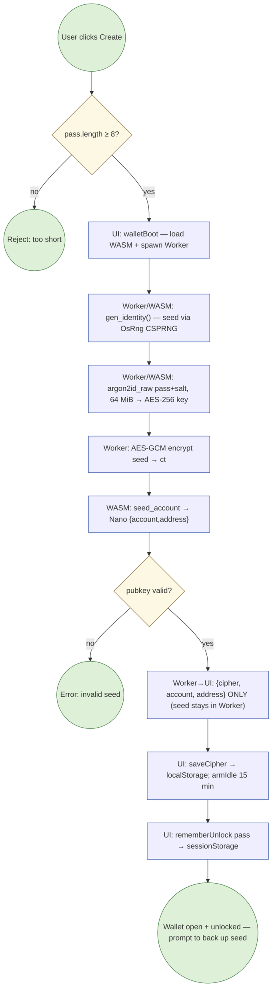

At-rest custody: `passphrase → Argon2id (m = 64 MiB, t = 2, p = 1, v0x13, 32-byte
tag) → AES-256-GCM`, salt 16 random bytes, IV 12 random bytes, both stored beside
the ciphertext. The seed is generated with `OsRng` (`gen_identity`,
`wasm-bridge/src/lib.rs`). `argon2id_raw` clamps memory to a floor of 19 MiB
(`mem_kib.max(19 * 1024)`), so a caller cannot weaken it below the OWASP minimum.

**Verified 2026-08-26** (Chrome 151, live origin): the create→lock→unlock
round-trip is deterministic and correct — same passphrase reopens the wallet
from a cold Worker and across a reload; a wrong passphrase fails the GCM tag and
surfaces as `wrong passphrase`. The KDF parameters have never changed since the
feature landed (`f8247ad`), so no wallet can have been orphaned by a parameter
drift. **A "wrong passphrase" on a wallet you believe is correct therefore means
the stored blob was re-encrypted under a different passphrase** — i.e. a later
*Create* or *Restore & set password* overwrote it (§2.2).

### 2.2 Restore from backup seed

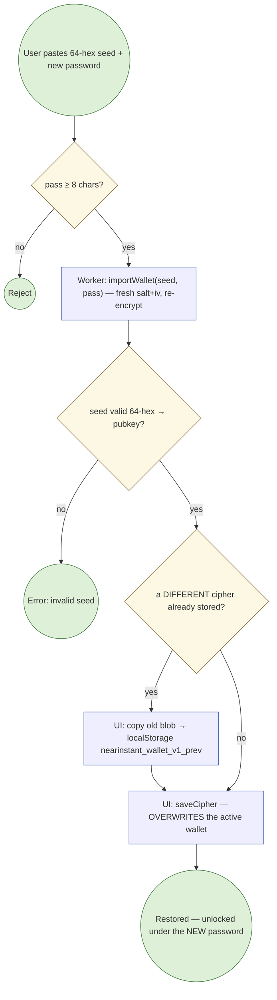

Restore **sets a new password** for this device (the `wImportPass` field) — it
does not reuse the previous one. This is the most common way a device ends up
with a wallet whose passphrase is not the one the user remembers.

The `_prev` safety net (`a0a13d7`) keeps the previous encrypted blob before an
overwrite, but it is **still only openable with its own passphrase** and it was
added late — wallets overwritten before that commit have no backup. Restore is
**64-hex only** (no BIP39 mnemonic).

### 2.3 Unlock (manual + auto-on-load) — now resumes the Monero scan

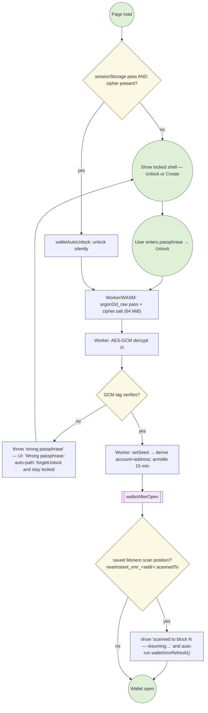

**New in `8196b4b`.** Previously an unlocked wallet showed a bare Monero balance
with no hint that a multi-thousand-block scan had ever run; the user had to know
to tap *Refresh & scan*. `walletAfterOpen` now reads the persisted scan record
(`{restore, scannedTo, outputs, spent}` per Monero address, checkpointed every
20 blocks), displays the block it reached, and **auto-resumes** the scan.
`walletAfterOpen` is also the hook that restarts a running Smart Offer, so an
offer never sits live on the beacon while the wallet that backs it is locked.

### 2.4 Lock / idle-lock

Explicit lock (`walletCta`), idle timeout (15 min, `armIdle`), and Smart Offer's
`keepAlive(true)` suspension are unchanged. Lock clears `seedHex` in the Worker
**and** `sessionStorage["nearinstant_unlock_sess"]`, so a lock is a real lock and
not just a UI state — `walletAutoUnlock` cannot silently reopen it afterwards.

### 2.5 Key isolation (cross-cutting invariant)

The seed exists only as `seedHex` inside the Worker closure. The UI thread can
request `sign`, `account`, `xmr_*` operations by `postMessage`, and receives only
results. The **single** path that returns the seed is `reveal`, which is gated on
`requireGesture()` — a fresh, real user gesture — so injected script cannot
exfiltrate it headlessly. `/api/work` (§1) receives a block root hash and nothing
else, so adding it did not widen this boundary.

---

## 3. Earn / Smart Offer + beacon

### 3.1 Start → poll/reprice loop

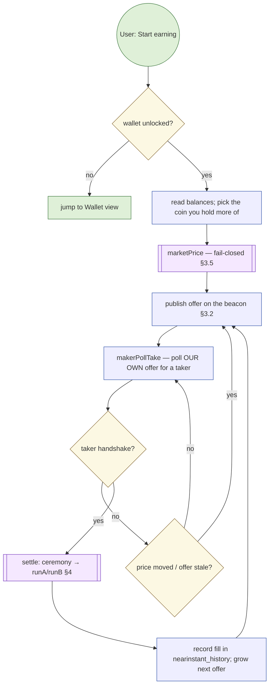

The provider loop is real: post → `makerPollTake` on the maker's own offer →
ceremony → `runA`/`runB` → record → re-post with earnings folded in. It runs
unattended while the page is open, with `keepAlive` suspending the idle lock and
a `beforeunload` warning if a settlement is mid-flight.

### 3.2–3.4 Offer encoding, read side, cancel

Unchanged from the previous revision: intents are packed into the **amount field
of a Nano send** (price, side, size, expiry), published on-chain, decoded by
`scan`/`scanLive`, and cancelled with a sentinel. On-chain publication is what
makes the order book censorship-resistant and asynchronous — an offer persists
without any server holding it.

### 3.5 Fail-closed pricing (`marketPrice`) — the safety spine

`marketPrice()` (`web/index.html:1009`) reads CoinGecko and Coinpaprika. If the
oracles disagree beyond tolerance, or none answers, it **throws** and no offer is
published or repriced. Nothing is ever quoted from a single unchecked source.
This is the guard that stops a poisoned price from writing a bad offer on-chain.

### 3.6 Earn accounting + the calculator (REFRAMED)

Earnings are **taker-fee-derived**: a maker captures the ~0.8 % spread each time
their liquidity is traded through. There is no yield on idle capital, no
inflation, no token.

**Changed in `37b7207`.** The calculator previously presented **rank tiers**
(Bronze/Silver/Gold/Founder) with an implied %/month on *capital*, plus claims
that a higher tier gets "picked first" and "carries bigger trades". Both the
capital framing and the priority claim were unsupported by the engine, which has
no tenure or rank input at all. The calculator now exposes the **only** variable
that actually drives earnings — **monthly turnover** (how many times your coins
are traded through per month, each pass paying the spread) — presented as
user-chosen **scenarios**, labelled `SCENARIO`, not levels and not a promise.
Tenure- and priority-based language is gone.

> **Honest note.** `fills` and "earned" are still read from the device-local
> `nearinstant_history` record (spread ≈ MARGIN × received), **not** recomputed
> from the public ledger. Two devices show two different totals for the same
> wallet. See §9.

---

## 4. Atomic swap core (two-pool collaboration)

### 4.1 Collaboration overview

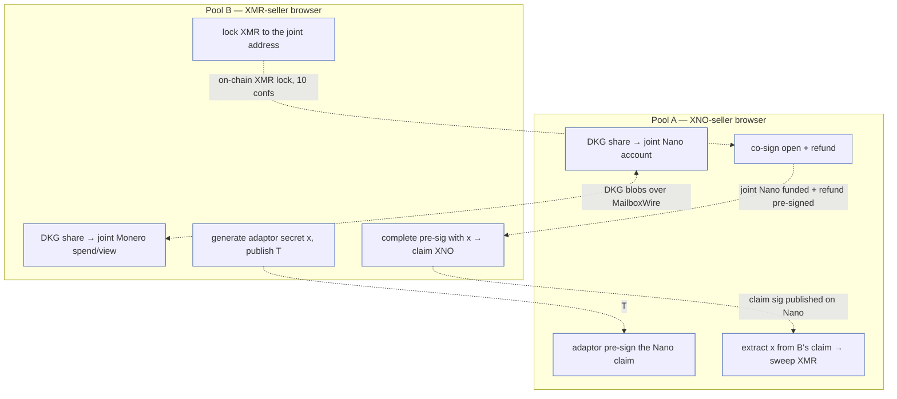

The link is an **adaptor signature**: B can only claim the Nano by completing a
pre-signature with the secret `x`, and doing so publishes `x` on-chain, which A
extracts to sweep the Monero. One secret unlocks both legs — that is the
atomicity.

### 4.2 Cryptographic sub-processes

Unchanged. 2-of-2 FROST DKG and signing (`swap-core/signing`), adaptor
pre-signature / complete / extract (`signing/src/adaptor.rs`), joint Monero
spend key and `shared_view_key` (`monero-side`), all exposed to the browser
through `wasm-bridge` (`BrowserDkg`, `BrowserSigner`) and `wasm-monero`.

### 4.3 Settlement driver — Monero side now fully narrated

**Changed in `c46caa8`.** Monero is the slow leg (a 10-confirmation wait is
~20 min) and previously a silent minute was indistinguishable from a hang.
`web/two_party.js` now emits a line for every phase:

| Phase | Narration |
|---|---|
| connect | `Monero: connecting to a node…` |
| scan | `scanning blocks N–M for the X XMR lock (chain at T) · P%` |
| lock broadcast | `lock tx abc123… broadcast ✓ — taker waits ~20 min for 10 confirmations` |
| confirming | `lock found at block N · c/10 confirmations · ~m min left · checking again in 45 s` |
| not yet seen | `no X XMR lock on the joint address yet · re-scanning in 45 s (check n)` |
| confirmed | `lock of X XMR confirmed ✓ (block N, c confirmations)` |
| sweep | `building the sweep (ring signature with real decoys + fee)` → `broadcasting` → `sweep tx abc123… broadcast ✓` |

`waitJointXmrLock` scans in 10-block windows from `sinceHeight − 5` (or
`tip − 720` cold), polls every 45 s, and requires `XMR_CONF = 10`.

Logs are rendered by `logTo(id, m)`: timestamped, newest at the bottom,
auto-scrolling, with the **latest line repeated in bold at the top** so the
current state is one glance away.

### 4.4 Atomicity & the counterparty-abort gap

Unchanged and still the sharpest edge: there is a **refund/timelock path
pre-signed for the Nano leg**, but a counterparty who aborts at the wrong moment
can still strand the Monero leg pending manual recovery. The `pledge` crate
(bilateral grief bonds) and `puzzle-escrow` (I1 time-lock refund backstop) are
built and exposed to wasm, but the **browser executor that would drive them is
not wired** (§9). Use small amounts.

---

## 5. Taker order book — the selected offer now drives settlement

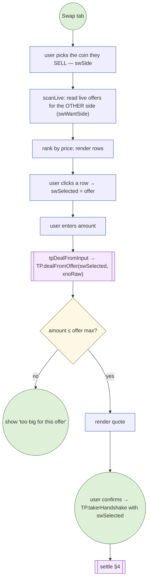

**Gap 1 of the previous revision is CLOSED.** `swSelected` was cosmetic — ranked
and displayed, but never read by any settlement back-end, which ran hard-coded
0.0001↔0.0001 amounts. It now drives the real path: `tpDealFromInput`
(`index.html:2207`) reads `swSelected.intent.price_e9`, converts the typed
amount to `xnoRaw` in the direction implied by `swSide`, rejects an amount above
`offerMaxXnoRaw(swSelected.intent)`, and builds the deal via
`TP.dealFromOffer(swSelected, xnoRaw)`. `takerHandshake(M, tpRelay(), swSelected,
deal, tpLog)` (`index.html:2256`) carries that exact offer into settlement.

Roles follow the offer's side: side 1 (maker sells XMR) ⇒ taker is **A**
(XNO-seller); side 0 ⇒ taker is **B** (XMR-seller).

**The self-test UI is gone entirely** (`e495862`). There is no mode selector, no
`?twoparty=1` URL flag, and no `xnoxmr_swmode` state: `TWO_PARTY = false` and
`swMode = "peer"` are constants, and the Swap tab is only ever
swap-with-someone. The underlying engine paths remain for automated tests.
Direction buttons can no longer be locked by leftover self-test state
(`01b47d7`).

---

## 6. Async transport / signaling

All transports expose the same `post(mailbox,seq,blob)` / `fetch(mailbox,seq)`
interface consumed by **`MailboxWire`**, which wraps every message in AES-GCM
with the sequence number bound as additional-authenticated-data (so tamper,
reorder, or misroute makes decrypt throw). The ceremony code is
transport-agnostic.

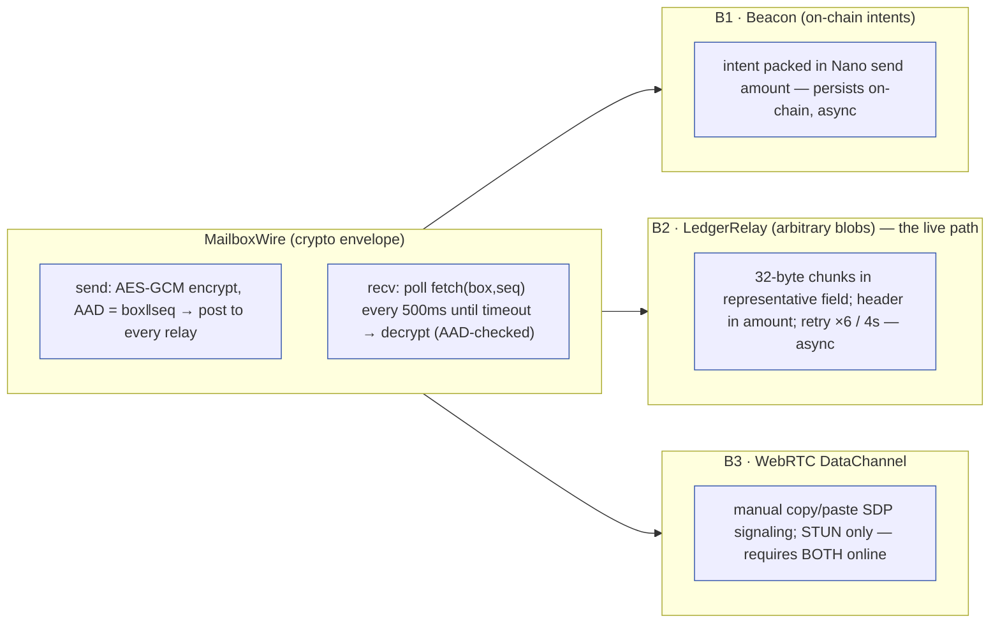

`tpRelay()` (`index.html:2201`) builds the live transport:
`makeLedgerRelay({beacon, wasm, urls: rpcState.nano, seed})` — **B2**, riding the
user's own configured Nano nodes. There is no relay server.

**Async property (works if only one party is online at a time):** B1 and B2 write
to the public ledger, so a blob persists as an on-chain receivable until the peer
next comes online and fetches it. **B3 (WebRTC) is the exception** — it needs
both browsers connected simultaneously.

---

## 7. RPC reliability / failover

### 7.1 Nano — failover, HTTP-200 ban bodies, and the read quorum

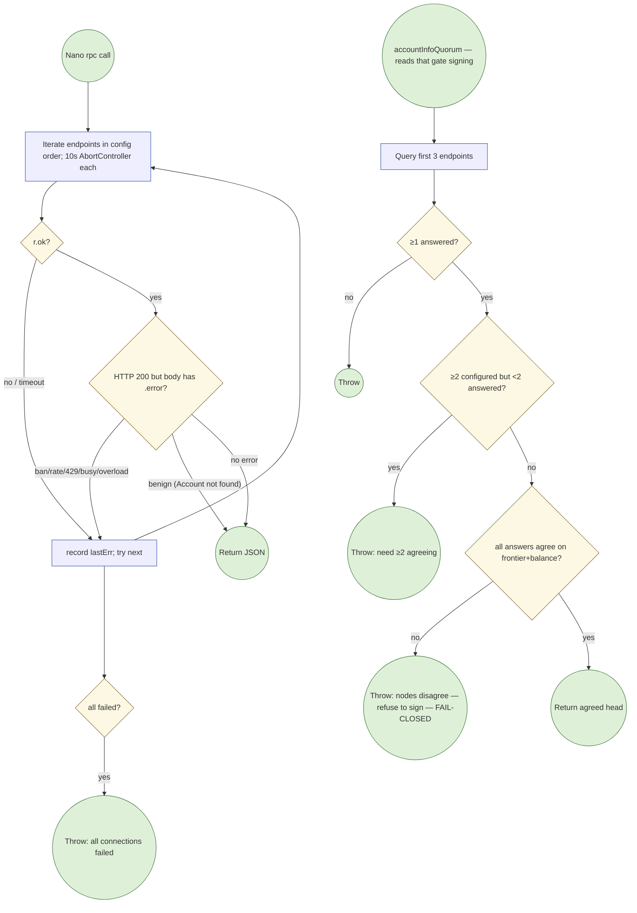

**New in `91937de`.** Some public nodes answer a rate-limit with **HTTP 200 and
an error body** (`rpc.nano.to` returns `{"error":429,"message":"IP banned…"}`).
The old code treated any 200 as success and returned that object as data.
`beacon.js` now inspects the body: a **numeric** `error`, or a message matching
`/ban|abuse|rate|too many|429|busy|overload|unavailable|penalty|limit/i`, is
treated as a node failure and fails over. Benign query errors ("Account not
found", "Bad account number") still pass through as legitimate answers — the
distinction matters, because a fresh account legitimately reports not-found.

Node order (`RPC_DEFAULTS.nano`): `rpc.nano-gpt.com` (added in `a9fbfa2` — open
CORS, serves both `process` and reads, no 200-ban behaviour), then
`rainstorm.city`, `node.somenano.com`, `nanoslo.0x.no`, `rpc.nano.to`.

`processBlock` broadcasts the **same** signed block to **every** node
(idempotent, censorship-resistant). The quorum's disagreement check is the key
anti-manipulation guard: a lying node cannot under-report balance to trick a send.

### 7.2 Nano proof-of-work — three-step chain with a local-only escape

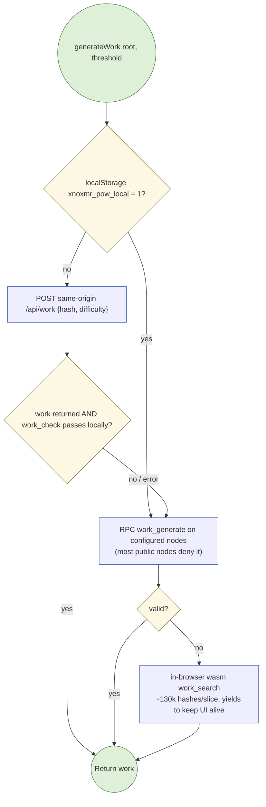

**Every returned work value is re-verified locally** with
`wasm.work_check(root, work, threshold)` before use — the proxy and the RPC nodes
are **untrusted**. A malicious proxy can at worst deny service; it cannot make
the browser accept invalid work, and it never learns anything but a public root
hash. The **local-only** toggle (Settings → Proof-of-work) skips step 1 entirely.

### 7.3 Monero — rotation, no quorum, and what the browser will actually connect to

`xmrPost` uses a 12 s timeout; `xmrRefresh`/`xmrSend` iterate the node list and
**rotate to the next node on any error** (the round-robin index persists across a
chunked scan, so a bad node is skipped for the whole scan). Scans checkpoint to
localStorage every 20 blocks and are resumable (§2.3). **Monero has no
cross-node quorum** — the first working node wins.

**Node reachability is a hard browser constraint, not a preference.** Re-verified
in Chrome 151 on 2026-08-26 against every node in the wallet's default list and
the Unstoppable Wallet node list:

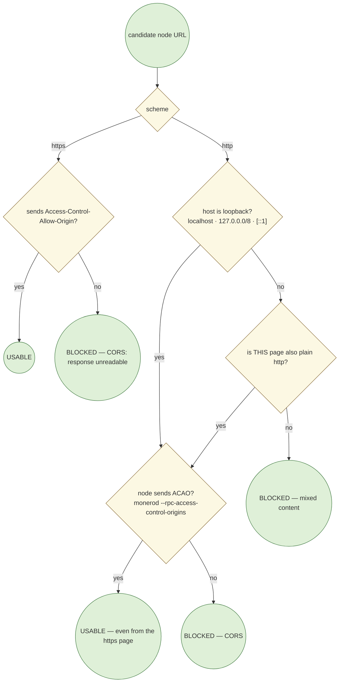

Two independent gates, both enforced by the browser's fetch stack and
**not overridable from page code**:

1. **Mixed content** — an `https` page may not open plain `http` to a *public*
   host. **Loopback is exempt**: Chrome treats `http://localhost` and
   `http://127.0.0.1` as potentially trustworthy, so they connect fine from the
   hosted https page (verified against a local daemon on 2026-08-26).
2. **CORS** — any cross-origin response without `Access-Control-Allow-Origin` is
   unreadable, regardless of scheme. There is no way around this: the
   preflight-avoiding "simple request" trick (`content-type: text/plain`, which
   monerod accepts) removes the preflight but the *response* still needs ACAO, and
   `mode:"no-cors"` yields an opaque body. Tested and confirmed failing.

**Raw TCP is not available to this page.** The WICG Direct Sockets API
(`TCPSocket`/`UDPSocket`/`TCPServerSocket`) is real, but exposed only to
**Isolated Web Apps** — and IWAs reach end users only on ChromeOS. Confirmed
empirically: `typeof TCPSocket === "undefined"` on the live origin in Chrome 151.
This is why a node list that works for a **native** wallet (Unstoppable, Cake,
Monerujo — all speaking raw HTTP on 18081/18089) is largely unusable here; the
nodes are healthy, the browser simply refuses the connection.

| Node | Alive | Browser-usable | Why |
|---|---|---|---|
| `https://xmr.hexide.com:443` | ✅ | ✅ **default** | https + CORS |
| `https://node.sethforprivacy.com:443` | ✅ | ✅ **default** (added `a050c5e`) | https + CORS; `json_rpc`, `get_outs`, `get_blocks.bin` all verified |
| `https://xmr-node.cakewallet.com:18081` | ✅ | ✅ **default** | https + CORS |
| `http://127.0.0.1:18081` (your own) | — | ✅ **best** | loopback exempt from mixed content; needs `--rpc-access-control-origins` |
| `xmr.unstoppable.money:443` | ✅ | ❌ | https but **no ACAO**; preflight → 405 |
| `node.xmr.rocks:18089` | ✅ | ❌ | http-only + no ACAO |
| `opennode.xmr-tw.org:18089` | ✅ | ❌ | http-only + no ACAO |
| `nodex.monerujo.io:18081` | ✅ | ❌ | http-only + no ACAO |
| `monero.stackwallet.com:18081` | ✅ | ❌ | http-only + no ACAO |
| `xmr.cryptostorm.is:18081` | ❌ | ❌ | retired `a050c5e` — no longer answers |
| `xmr.triplebit.org` | ❌ | ❌ | retired `a050c5e` — no longer answers |

**Run your own node — the intended path.** `wallet.js`'s `usableNode()` now
accepts loopback `http://` URLs (previously every non-`https://` entry was
silently dropped, so a user could add their own node in Settings and it would
never be used). Settings documents the one-line daemon flag. This is the only
configuration in which no third party learns which addresses you query.

**List maintenance.** `rpcLoad` merges: a saved user list keeps the user's own
entries, drops URLs listed in `RPC_RETIRED`, and gains any new verified default
the user does not yet have — so a browser with a stale saved list self-heals
without discarding custom nodes.

> **Honest note.** `rpcCheck` probes each node's health and latency but is used
> **only to paint the settings panel** — it does **not** reorder the active node
> list at runtime. Node order is user-config order, seeded healthy-first.

---

## 8. Monero wallet maturity — measured against a reference implementation

A full audit of **Unstoppable Wallet (Android)** + `monero-kit` was run on
2026-08-26 and compared against our wallet. The reference delegates essentially
everything to native `wallet2`; we reimplement it in Rust/wasm, so it is a fair
mirror for what a mature Monero wallet does that we do not. **Every item below
was re-verified directly in our source** before being recorded here.

### 8.1 Scanning cost — the dominant performance problem

`scan_all` walks `scannable_block_by_number(n)` **one block at a time**
(`wasm-monero/src/lib.rs:381-423`), 20 blocks per worker message, with a fresh
`XmrNode::connect` + `height()` per chunk (`wallet-worker.js:192-204`). Each
block fans out to roughly 3–5 HTTP round trips (block hash → get_block →
get_transactions → get_o_indexes.bin), so a 20-block chunk costs ~60–100
requests and a cold 4320-block scan costs **~20,000 requests**.

The dependency we already ship exposes the batched form:
`contiguous_scannable_blocks(range)` in `monero-daemon-rpc` issues **one** epee
`get_blocks.bin` POST for the whole range, with an automatic JSON-batch
fallback. Our JS transport already handles binary bodies (`get_blocks.bin` was
verified working against the default nodes). This is the single largest available
speed win and it is a call-the-existing-API change, not new cryptography.

### 8.2 Verified correctness defects in `xmrSend`

| # | Defect | Evidence | Consequence |
|---|---|---|---|
| 1 | **Single-input sends only** | `wallet.js:385-390` filters for one output covering the amount, sorts descending, takes `usable[0]`; throws `no single spendable output covers …` | A wallet holding the amount across several outputs **cannot spend it at all**. Also always spends the largest output — a consolidation/privacy anti-pattern. |
| 2 | **Fee is a hardcoded guess** | `wallet.js:388` — `BigInt(o.amount) > amount + 200000000n` (0.0002 XMR headroom) | No fee is ever queried, computed, or shown to the user before they commit. |
| 3 | **Fee rate sanity check disabled** | `lib.rs:462,519` — `fee_rate(FeePriority::Normal, u64::MAX)`; the crate documents `max_per_weight` as a MUST sanity-check | A hostile node can quote an absurd fee rate and we build, sign and publish in the same call with no confirmation step. |
| 4 | **Failover re-signs the transaction** | `wallet.js:394-399` — the whole `xmr_send` (build + sign + relay) is retried against the next node | If node 1 actually relayed but the reply was lost, node 2 gets a **second signature spending the same key image**. |
| 5 | **Spent-set written after broadcast** | `wallet.js:403-404` — `st.spent.push` runs after `call("xmr_send")` resolves | A crash between relay and write leaves a spent output marked spendable. |
| 6 | **Ring size hardcoded to 16** | `lib.rs:457,514` — `OutputWithDecoys::new(…, 16, …)` | Silently breaks at the next consensus ring-size change; the reference passes `mixin=0` to inherit the consensus default. |
| 7 | **No send-max / sweep** | no `Change::None` path | The wallet can never be emptied. |
| 8 | **Send permitted mid-scan** | `xmrSend` calls `xmrRefresh` but does not require `scannedTo >= tip` | Spending against a stale output set. |
| 9 | **Address validated by regex only** | `index.html:1494`, `wallet.js:379` — `/^[1-9A-HJ-NP-Za-km-z]{95,106}$/`; real parse happens in Rust at build time | Typos surface after a multi-minute scan rather than at entry. |
| 10 | **Health data collected then discarded** | `rpcCheck` (`index.html:631`) measures height + latency for the Settings panel only; scan/send walk `rpcState.monero` in list order | A node hundreds of blocks behind is used if it is first, corrupting confirmation counts and swap timelocks. |

The reference ranks nodes by **height descending, then latency ascending**
(`BestNodeComparator`), pinged 10-wide with a hard 5 s cap. Adopting that
ordering is cheap — we already collect both numbers.

### 8.3 Privacy gaps vs. the reference

- The reference **never reuses an address**: every receive is a fresh unused
  subaddress (index 0 explicitly excluded), and change goes to a new subaddress.
  We use **one static primary address forever**, for every deposit, every swap
  sweep, and every change output (§9.9).
- Our per-address scan cache (`nearinstant_xmr_<addr>`) is written to
  localStorage in **plaintext** — outputs, amounts, block heights, spent set.
  The seed is Argon2id+AES-GCM protected; the transaction graph derived from it
  is not. Anything with DOM access reads a full history.

---

## 9. Known gaps & honest notes

True of the code as it stands, so the diagrams above are not read as more than
they are. **Closed since the last revision:** old gap 1 (`swSelected` cosmetic —
now drives settlement, §5) and old gap 7 (earn tier calculator framing — reframed
to turnover scenarios, §3.6).

1. **No refund/timelock in live two-party settlement** (§4.4). `pledge` (grief
   bonds) and `puzzle-escrow` (I1 time-lock refund) are built and exposed to
   wasm, but the browser executor that drives them does not exist. A
   counterparty who aborts at the wrong moment can strand the Monero leg pending
   manual recovery. **Use small amounts.**
2. **Chunked auto-responder not wired to chain.** `swap_machine.js` /
   `swap_responder.js` ship, but with no browser executor for bonds/guard/chunks
   a person-to-person swap is **one chunk = the whole amount**.
3. **Mid-ceremony resume needs both browsers.** Snapshots and per-step markers
   persist (`nearinstant_2p_*`, indexed in `nearinstant_2p_index`) and appear
   under *Unfinished swaps*, but only the post-co-sign tail (A after `x`, B after
   `claim`) resumes unattended. The co-sign middle is not resumable across a
   reload — the mailbox wire and signer nonces are in memory. A re-handshake
   protocol is needed.
4. **Monero send is single-input, unpriced, and re-signs on failover** — see
   §8.2, items 1–5. These are the most consequential open defects in the wallet.
5. **Monero scanning is ~20,000 requests cold** (§8.1) because the batched
   `get_blocks.bin` path in a dependency we already ship is unused.
6. **Monero has no read quorum** — timeout + node rotation only. Nano's
   fail-closed quorum has no Monero equivalent.
7. **No dynamic health-first RPC ordering.** `rpcCheck` paints the settings panel
   and nothing else (§7.3, §8.2 item 10).
8. **Restore is 64-hex only** (no BIP39) and **overwrites** the active wallet.
   The `_prev` backup exists only for overwrites after `a0a13d7`, and is itself
   only openable with its own passphrase (§2.2). This is the usual cause of a
   "wrong passphrase" on a wallet the user believes is correct.
9. **On-chain linkability (Monero privacy).** The sweep sends received XMR to the
   wallet's **primary address**, reused on every swap, and the Nano claim goes to
   the main Nano account; change also returns to the primary address. An observer
   can link swaps to each other and to the user's main Monero identity. The fix —
   a **fresh subaddress per sweep/change** (and fresh Nano account per claim) —
   needs new derivation plus subaddress-aware scanning in
   `wasm-monero`/`wasm-bridge` (`xmr_personal`/`scan_all` are primary-address
   only), so it is a Rust/wasm change, not a frontend edit. Documented to users
   in the FAQ; deferred until it can be verified on-chain, because an untested
   sweep to an unscanned subaddress would strand funds.
10. **Scan cache is plaintext** in localStorage (§8.3).
11. **Fills / earnings are device-local.** They come from `nearinstant_history`
    on this device (spread ≈ MARGIN × received), not recomputed from the public
    ledger, so two devices disagree for the same wallet.
12. **One backend function now exists** (`/api/work`, §1). It is minimal,
    untrusted (its output is re-verified locally), and defeatable via the
    local-only PoW toggle — but the literal "zero servers" claim no longer holds
    and should not be repeated in user-facing copy without that qualifier.
13. **Most public Monero nodes are unusable from a browser** and this is not
    fixable in page code (§7.3). Running your own node on loopback is the
    intended and strongest configuration.
14. **No two-browser on-chain swap has been completed end-to-end.** The
    person-to-person flow is verified against mocks and in unit/integration
    tests; a real mainnet run with two independent browsers is still outstanding.

---

*Generated from the codebase. When code changes, regenerate the affected
section rather than editing the diagram in isolation.*
